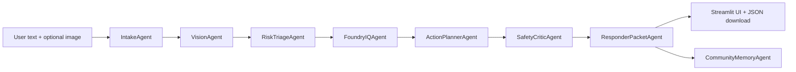

<p align="center">
  
</p>

<h1 align="center">🚨 MaydaIQ</h1>

<p align="center">
  <strong>Multimodal crisis intelligence for safer communities.</strong><br />
  Your first 60 seconds, your next 60 minutes, and your community's next 60 days.
</p>

<p align="center">
  <a href="https://youtu.be/TtZe2kexU4I"><strong>▶ Watch Demo Video</strong></a>
  <a href="https://maydaiq-afdbv2ezxujuz6gex2wsx8.streamlit.app/?embed_options=light_theme"><strong>▶ Play Demo (Without Foundry)</strong></a>
  ·
  <strong>Microsoft Agents League 2026</strong>
  ·
  <strong>Reasoning Agents Track</strong>
</p>

---

## Why MaydaIQ Matters

Would you trust your life to a generic chatbot?

Probably not blindly. In a real crisis, people do not need a long, vague answer. They need immediate, concrete, safety-first actions, and responders need structured information they can actually use.

**MaydaIQ** is a multimodal, multi-agent crisis assistant that turns a text report plus an optional image into:

- immediate citizen-facing safety guidance,
- grounded calm-mode response plans,
- a responder-ready incident packet,
- anonymized community resilience data.

It is designed for **Microsoft Foundry + Foundry IQ**, while remaining fully runnable in local demo mode with deterministic fallback logic and Markdown safety playbooks.

---

## Judge-Friendly Summary

| Area | What MaydaIQ demonstrates |
|---|---|
| **Track fit** | Reasoning agent for complex crisis-response decisions. |
| **Microsoft IQ** | Foundry IQ / attached knowledge documents ground crisis playbooks and safety guidance. |
| **Multi-step reasoning** | Intake → vision labels → risk triage → retrieval → planning → safety review → responder packet. |
| **Reliability & safety** | Conservative escalation, confidence gates, Pydantic schemas, no real dispatch, privacy redaction. |
| **Multimodal value** | Text plus optional image signals are converted into structured hazard context. |
| **Real-world potential** | Civic incident intake, emergency preparedness, NGO coordination, environmental citizen science. |

---

## What It Does

MaydaIQ supports three interaction modes:

- **Alert Mode** — short, urgent, safety-first guidance for situations happening now.
- **Calm Mode** — more detailed preparedness, reporting, or post-incident analysis with citations and uncertainty notes.
- **Auto Mode** — automatically switches behavior based on risk level, urgency keywords, and visual hazard labels.

Example scenarios:

- flooded street with possible electrical hazard,
- smoke or fire near a building,
- traffic accident with a possible injured person,
- robbery or personal safety threat,
- suspicious water pollution / benthic bioindicator report,
- air-quality / lichen citizen-science observation.

---

## Why This Is Not a GPT Wrapper

MaydaIQ is an orchestrated reasoning system, not a single prompt around a chatbot.

- **IntakeAgent** normalizes the incident report, language, location, and urgency.
- **VisionAgent** extracts privacy-safe visual hazard labels from uploaded images or demo scenarios.
- **RiskTriageAgent** applies deterministic risk scoring and selects Alert or Calm behavior.
- **FoundryIQAgent** retrieves grounded crisis guidance from Microsoft Foundry / Foundry IQ or local playbooks.
- **ActionPlannerAgent** creates citizen-facing actions according to the selected mode.
- **SafetyCriticAgent** blocks risky advice, overconfidence, unsafe escalation gaps, or privacy issues.
- **ResponderPacketAgent** generates structured JSON for responders.
- **CommunityMemoryAgent** stores anonymized hazard metadata for resilience analysis.

Every structured output validates through **Pydantic schemas**. High severity or low confidence forces `human_escalation_required=true`. The app never performs real dispatch; `simulate_emergency_report()` is explicitly simulated.

---

## Architecture



---

## Run Locally

The app runs without Azure credentials in local demo mode.

```bash
python -m venv .venv

# Windows
.venv\Scripts\activate

# macOS / Linux
source .venv/bin/activate

pip install -r requirements.txt
streamlit run app.py
```

By default, `.env.example` can run in demo mode with deterministic fallback logic and Markdown knowledge files.

---

## Connect Microsoft Foundry + Foundry IQ

1. Copy `.env.example` to `.env`.
2. Set live mode:

```env
DEMO_MODE=false
```

3. For an existing Foundry agent with documents already attached, fill the minimum live values:

```env
AZURE_FOUNDRY_PROJECT_ENDPOINT=
AZURE_FOUNDRY_AUTH_MODE=entra
AZURE_FOUNDRY_TOKEN_SCOPE=https://ai.azure.com/.default
AZURE_FOUNDRY_AGENT_ID=
AZURE_FOUNDRY_AGENT_VERSION=
AZURE_FOUNDRY_MODEL_DEPLOYMENT=
```

4. Authenticate locally with `az login`, or configure service-principal credentials for hosted deployment:

```env
AZURE_TENANT_ID=
AZURE_CLIENT_ID=
AZURE_CLIENT_SECRET=
```

5. Run the app. The retrieval adapter logs `FOUNDRY_AGENT_LIVE` when it attempts live Foundry retrieval, and `LOCAL_DEMO_RETRIEVAL` when it falls back.

See [`docs/azure_foundry_testing.md`](docs/azure_foundry_testing.md) for the practical setup checklist.

---

## Knowledge Pack

The Foundry IQ / local fallback knowledge pack lives in `data/knowledge_pack/`:

- `emergency_flood.md`
- `emergency_fire_smoke.md`
- `emergency_traffic_accident.md`
- `personal_safety_robbery.md`
- `electrical_hazards.md`
- `environmental_water_quality_benthic.md`
- `environmental_air_quality_lichen.md`
- `community_reporting_schema.md`
- `safety_policy.md`

Recommended indexing fields:

- `source_id`
- `purpose`
- `signs`
- `immediate_actions`
- `avoid`
- `when_to_call_emergency_services`
- `calm_mode_guidance`
- `responder_packet_fields`
- `safety_notes`

---

## Safety Model

MaydaIQ is conservative by design:

- It is not an emergency service and never claims to contact authorities.
- It advises local emergency services for life risk, fire, injury, violence, floodwater, electricity, or immediate danger.
- It never identifies people, faces, license plates, suspects, or private individuals.
- It avoids confrontation, pursuit, vigilantism, unsafe re-entry, and invasive medical instructions.
- It includes confidence and uncertainty notes in every structured result.
- Low confidence or high severity triggers human escalation.

---

## Privacy Model

Community memory stores only anonymized hazard labels, approximate location text, risk level, and redaction notes. Raw images are not stored. Responder packets include `simulated_only=true`.

---

## Future Potential

MaydaIQ can evolve into:

- a municipal incident-intake assistant,
- a preparedness and simulation tool for civil defense teams,
- an NGO coordination assistant during crises,
- an environmental citizen-science reporting platform,
- a safety-first agentic AI pattern for high-stakes public-service workflows.

---

## Disclaimer

This repository contains synthetic/demo data only. Do not enter confidential information. MaydaIQ does not make real emergency calls, SMS messages, emails, police reports, or dispatch requests. In a real emergency, contact local emergency services directly.
