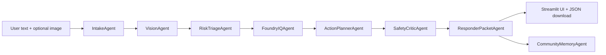

# MaydaIQ

**Track:** Microsoft Agents League 2026 - Reasoning Agents

MaydaIQ converts panic into safe action: your first 60 seconds, your next 60 minutes, and your community's next 60 days.

MaydaIQ is a multimodal, multi-agent crisis assistant that turns a text report plus an optional image into immediate safety guidance, grounded response plans, and a responder-ready incident packet. It is designed for Microsoft Foundry + Foundry IQ integration, but it also runs fully in local demo mode with deterministic fallback logic and Markdown knowledge files.

## Why This Is Not A GPT Wrapper

MaydaIQ is an orchestrated reasoning system:

- Separate agents handle intake, privacy-safe vision labels, deterministic risk scoring, Foundry IQ retrieval, planning, safety criticism, responder packet generation, community memory, and translation fallback.
- Every output validates through Pydantic schemas.
- High severity or low confidence forces `human_escalation_required=true`.
- Calm Mode requires grounded citations from Foundry IQ or the local knowledge pack.
- The app never performs real dispatch. `simulate_emergency_report()` is simulated only.

## Architecture



## Modes

- **Alert Mode:** Max four short bullets, focused on physical safety and emergency escalation.
- **Calm Mode:** Preparedness, analysis, or post-incident planning with citations, checklist, unknowns, confidence, and next steps.
- **Auto Mode:** Deterministically chooses Alert or Calm based on severity, urgency keywords, and image hazard labels.

## Run Locally

```bash
python -m venv .venv
.venv\Scripts\activate
pip install -r requirements.txt
streamlit run app.py
```

The default `.env.example` uses `DEMO_MODE=true`, so no Azure credentials are required.

## Connect Microsoft Foundry + Foundry IQ

1. Copy `.env.example` to `.env`.
2. For an existing Foundry agent with documents already attached, fill the minimum live values:
   - `AZURE_FOUNDRY_PROJECT_ENDPOINT`
   - `AZURE_FOUNDRY_API_KEY`
   - `AZURE_FOUNDRY_AGENT_ID`
3. Set `DEMO_MODE=false`.
4. If you do not use an API key, authenticate with `az login`, or fill the service-principal variables.
5. Install dependencies with `pip install -r requirements.txt`.
6. Run the app. The retrieval adapter logs `FOUNDRY_AGENT_LIVE` when it attempts live Foundry agent retrieval, and `LOCAL_DEMO_RETRIEVAL` when it falls back.

Optional variables:

- `AZURE_FOUNDRY_MODEL_DEPLOYMENT`: useful for creating agents/direct model calls, not required for an existing agent call.
- `AZURE_FOUNDRY_AGENT_NAME`: supported for newer agent-reference flows.
- `FOUNDRY_IQ_KNOWLEDGE_BASE_ID` and `FOUNDRY_IQ_CONNECTION_NAME`: not required when your documents are already attached to the agent.

See [Azure Foundry live testing](docs/azure_foundry_testing.md) for the practical setup checklist.

People using the public demo do not need a Microsoft account. MaydaIQ authenticates server-side with `.env` credentials or runs in local fallback mode.

## Index The Knowledge Pack Into Foundry IQ

Use the Markdown files in `data/knowledge_pack/` as the seed corpus:

- `emergency_flood.md`
- `emergency_fire_smoke.md`
- `emergency_traffic_accident.md`
- `personal_safety_robbery.md`
- `electrical_hazards.md`
- `environmental_water_quality_benthic.md`
- `environmental_air_quality_lichen.md`
- `community_reporting_schema.md`
- `safety_policy.md`

Recommended indexing fields:

- `source_id`
- `purpose`
- `signs`
- `immediate_actions`
- `avoid`
- `when_to_call_emergency_services`
- `calm_mode_guidance`
- `responder_packet_fields`
- `safety_notes`

## Demo Scenarios

- Flooded street with possible electrical hazard.
- Smoke/fire near building.
- Traffic accident with injured person.
- Robbery / personal safety threat.
- Suspicious water pollution / benthic bioindicator report.
- Air quality / lichen citizen science report.

## Safety Model

MaydaIQ is conservative by design:

- It is not an emergency service and never claims to contact authorities.
- It advises local emergency services for life risk, fire, injury, violence, floodwater, electricity, or immediate danger.
- It never identifies people, faces, license plates, suspects, or private individuals.
- It avoids confrontation, pursuit, vigilantism, unsafe re-entry, and invasive medical instructions.
- It includes confidence and uncertainty notes in every structured result.

## Privacy Model

Community memory stores only anonymized hazard labels, approximate location text, risk level, and redaction notes. Raw images are not stored. Responder packets include `simulated_only=true`.


## Disclaimer

This repository contains synthetic/demo data only. Do not enter confidential information. MaydaIQ does not make real emergency calls, SMS messages, emails, police reports, or dispatch requests. In a real emergency, contact local emergency services directly.
