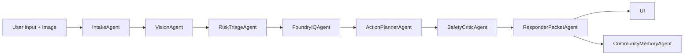

# MaydaIQ Architecture

## Agent Responsibilities

**IntakeAgent:** Normalizes text, detects basic urgency keywords, estimates language, and decides whether image analysis is needed.

**VisionAgent:** Converts an uploaded or simulated image into privacy-safe hazard labels such as `floodwater`, `smoke`, `fallen_wire`, or `lichen_observation`. It never identifies faces, people, plates, suspects, or private individuals.

**RiskTriageAgent:** Combines text and visual signals, computes a deterministic score from 0 to 100, selects Alert or Calm in Auto Mode, and decides whether human escalation is required.

**FoundryIQAgent:** Retrieves cited response playbooks. With credentials, it attempts a live Microsoft Foundry / Foundry IQ adapter. Without credentials or SDKs, it falls back to local Markdown retrieval.

**ActionPlannerAgent:** Produces the user-facing plan. Alert Mode is concise and safety-first. Calm Mode includes evidence, next steps, unknowns, and prevention suggestions.

**SafetyCriticAgent:** Checks for dangerous instructions, overconfidence, missing escalation, privacy risk, and unsupported claims. It revises conservatively when needed.

**ResponderPacketAgent:** Generates a structured JSON packet for human review and demo download. Every packet includes `simulated_only=true`.

**CommunityMemoryAgent:** Appends anonymized hazard labels and approximate context to `data/sample_reports.jsonl`. It does not store raw images.

## Live Foundry vs Demo Fallback

`src/tools/foundry_iq_retrieval.py` is the clean integration boundary.

- `DEMO_MODE=true`: use `LOCAL_DEMO_RETRIEVAL` and Markdown knowledge files.
- `DEMO_MODE=false` plus endpoint and agent id/name: attempt `FOUNDRY_AGENT_LIVE`.
- SDK import failure, auth failure, or live service failure: fall back to local retrieval so the demo stays reliable.

`src/tools/image_analysis.py` follows the same pattern for optional Azure Vision. If live vision is unavailable, MaydaIQ uses deterministic sample and filename/text hints.
